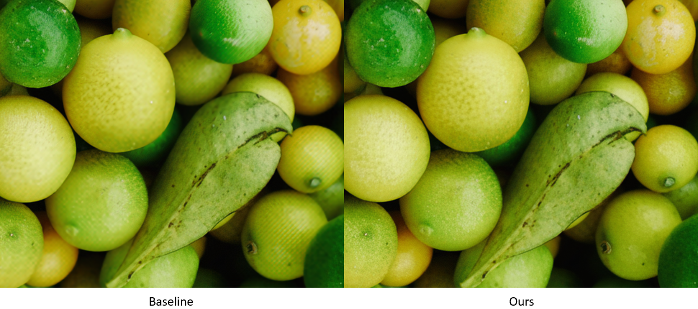
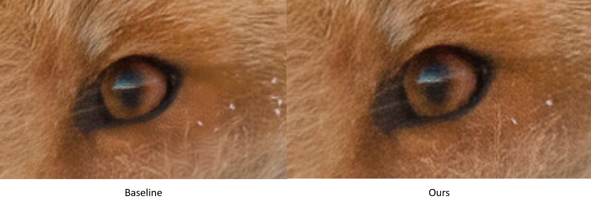
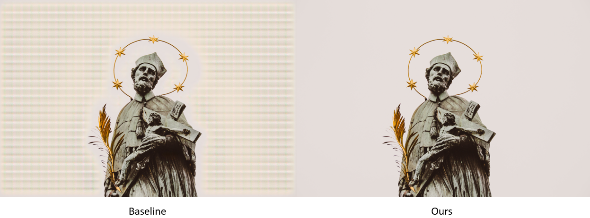
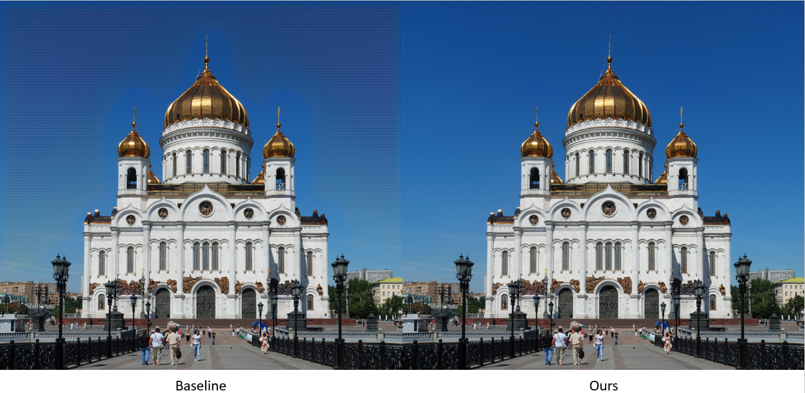

# Digital Image Processing Course Project
This repository contains the final project for my M.Sc. Digital Image Processing course at Sharif University of Technology.

## 📌 Overview

This project applies some modifications to the loss function of the baseline in order to enhance the quality of super-resolved images. The modified loss term consists of the image transform concept learned during the course. The results below show the effectiveness of our work.

This project was developed as a **team project** for the **Digital Image Processing** course at **Sharif University of Technology** in Spring 2025.

## 📊 Results

The following examples compare the results of the baseline vs. our work.

## 🛠️ Technologies

- Python
- PyTorch
- CUDA

## 👥 Contributors

This project was developed collaboratively by:

- **[Amir Hossein Bagherian](https://github.com/amir-H-bagherian)** — Built the codebase foundation and fixed bugs
- **[Hossein Behzad](https://github.com/hosseinBehzadasl)** — Modified the loss function
- **[Mahdi Teymouri](https://github.com/mahditn2000)** — Ran the code and prepared the results

### My Contribution

I was primarily responsible for:

- Adapting the codebase to run reliably on Kaggle
- Debugging and resolving compatibility and runtime issues
- Refactoring parts of the codebase to facilitate further development by the team

The project was developed collaboratively by all team members.

## 📚 References

1. [Paper](https://arxiv.org/abs/2211.13676)
2. [Official GitHub Repository](https://github.com/seungho-snu/SROOE)

## 📄 License

This project is licensed under the **MIT** License.

See the [LICENSE](LICENSE) file for details.
